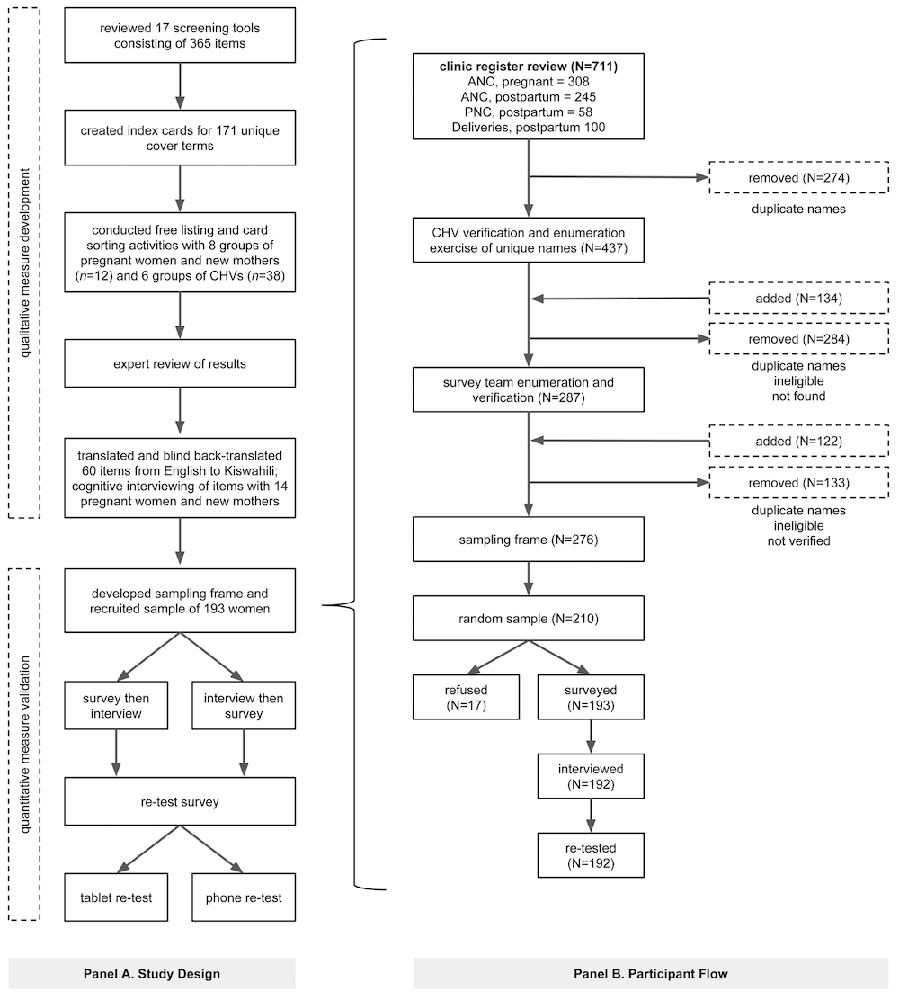

# Setting and Participants

We conducted this prospective study in Bungoma, Kenya. This rural county is situated in what used to be known as Western Province. When the 2010 Constitution of Kenya was enacted in 2013, 47 counties in a new devolved system of government replaced the existing 8 provinces. Bungoma is one of the largest counties in this new system. It is home to more than 1.6 million residents, nearly half of whom live in poverty [@Wiesmann:2014]. 

We recruited participants for two main study activities: (i) eight focus group discussions to develop a locally-anchored set of screening items and (ii) individual assessments to narrow the set of items and validate the new measure and two existing screening tools. A purposive sample of 12 women were invited to participate in the focus group discussions; women were eligible to participate if they were at least 18 years old and receiving maternity services from a particular primary health clinic (public dispensary) in Bungoma East subcounty. All 38 community health volunteers (CHVs) serving the clinic's catchment area were invited to participate in separate discussion sessions. 

For the validation study, we drew a random sample of 210 pregnant women and new mothers (from a sampling frame of 276) from the 27 villages wholly or partially located within a 2-kilometer radius from the clinic. All women had to be at least 18 years of age. Pregnant women in their second or third trimesters were eligible, as were new mothers 1 to 6 months postpartum. Women who miscarried or experienced a stillbirth or infant death linked to their most recent pregnancy were excluded from the study. 193 women completed questionnaires and semi-structured clinical interviews.

# Measures

## Screening Survey (Index Tests)
We identified 17 measures commonly used to assess perinatal depression (see Table A1 in the [Online Appendix](https://www.sciencedirect.com/science/MiamiMultiMediaURL/1-s2.0-S016503271730263X/1-s2.0-S016503271730263X-mmc1.pdf/271035/html/S016503271730263X/be8563ea377bdaa094ee8e1728e4e95c/mmc1.pdf)), created a database of 365 items, assigned every screening item a short cover term (e.g., crying, unhappy, heart racing), and reviewed each cover term for exact and approximate duplicates. Out of the initial 365 screening items, we identified 171 unique cover terms and wrote an index card (with English and Kiswahili writing) for each term in preparation for our focus group discussions. Through these discussions we created a 60-item survey that included several index tests: the Edinburgh Postnatal Depression Scale, the Patient Health Questionnaire-9, items from other existing screening tools, and new items generated by the focus groups. In addition to the screening items, the survey also included demographic questions from the Phase 6 and Phase 7 Demographic and Health Household and Woman's questionnaires [@DHSQ].

### Edinburgh Postnatal Depression Scale
The most commonly used screening instrument for perinatal depression is the 10-item self-report Edinburgh Postnatal Depression Scale (EPDS) [@Cox:1987]. The first validation study was conducted with 84 postnatal women in the United Kingdom and reported sensitivity of 86 percent, specificity of 78 percent, and a positive predictive value of 73 percent. A systematic review of 37 EPSD validation studies conducted between 1987 and 2008, however, revealed great heterogeneity in diagnostic sensitivity and specificity between studies for all cutoff points [@Gibson:2009]. 

Tsai et al. [-@Tsai:2013] recently extended this evaluation of the EPDS with a new systematic review of 25 studies that screened for perinatal depression in Africa; 16 of the 25 studies included in this review used the EPDS. The authors noted that the median estimated coefficient alpha of the EPDS was 0.84, and they calculated a pooled sensitivity and specificity of 0.94 and 0.77 (cut-off  $\geq$ 9) from 14 studies that assessed criterion validity. None of the included studies was conducted in Kenya.

### Patient Health Questionnaire-9
Another brief depression screening that is often used to assess perinatal depression is the Patient Health Questionnaire-9 (PHQ-9). At least two studies have investigated Kiswahili translations of the PHQ-9 in Kenya. Omoro et al. [@Omoro:2006] demonstrated an association between PHQ-9 scores, TNM stage (Classification of Malignant Tumors), and scores on a cancer-specific quality of life scale. Monahan et al. [-@Monahan:2009] found a correlation between scale scores and patient responses to the question, "In general how would you rate your overall health right now?" Neither study assessed validity by comparing results to a gold-standard, such as a clinical structured interview.

## Criterion Reference: Structured Clinical Interview for DSM-5
We used the Structured Clinical Interview for DSM-5, Research Version to diagnose cases of depression (SCID-5-RV) [@First:2015]. The SCID-5-RV is designed to be customized, and we opted to administer the non-patient overview, Module A on mood episodes with specifiers, Module BC for psychotic screening, and Module D for the differential diagnosis of mood disorders---all translated into Kiswahili prior to use. Table A2 in the [Online Appendix](https://www.sciencedirect.com/science/MiamiMultiMediaURL/1-s2.0-S016503271730263X/1-s2.0-S016503271730263X-mmc1.pdf/271035/html/S016503271730263X/be8563ea377bdaa094ee8e1728e4e95c/mmc1.pdf) details the modifications we made to each module. 

The target condition was Major Depressive Episode (MDE). To meet criteria for a current MDE according to the DSM-5 [@APA:2013], a woman had to experience at least 5 of 9 symptoms---including depressed mood (A1) or diminished interest or pleasure (A2)---during the same 2-week period within the past 1 month (Criterion A) and report that these symptoms caused clinically significant distress or impairment in functioning (Criterion B). Four Kenyan counselors (2 Bachelor’s-level, 2 Master’s-level) investigated all cases in which a general medical condition, substance abuse, or medication could be the etiological factor (Criterion C). Counselors also used Module B/C to determine if psychotic symptoms were primarily accounted for by a DSM-5 Psychotic Disorder (Criterion D). Counselors did not assess Criterion E of Module D (i.e., rule out manic or hypomanic episode); therefore, we could only diagnose MDE not Major Depressive Disorder.

If a woman's symptoms suggested a depressive disorder but the woman did not meet Criterion A for MDE, the counselor assessed Criteria B-D to possibly diagnose "Other specified depressive disorder".

## Alternate Criterion Reference: Local Diagnosis
In addition to using the SCID-5-RV to diagnose depression as defined by the DSM-5, we also asked counselors to use their clinical judgment and asked women to self-report on their well-being.

### Clinical judgment of diagnosis and functioning
Counselors responded to the following prompt to record a 'local' diagnosis that was not tied to the DSM criteria: "In your clinical judgment, do you think that this woman is 'depressed'?" Counselors also rated each woman's social and occupational functioning using the SOFAS rating scale included in the SCID-RV-5. SOFAS ratings can range from 0 to 100, with 100 representing "superior functioning".

### Client rating of functioning
Counselors asked women to rate their own well-being by indicating on which step of an imaginary 10-step ladder they stood. Women were told that people who were really struggling and not doing well stood on Step 1, and that people who were doing very well stood on Step 10. 

### Local reference standard: Concordance between counselor and client
If there was concordance between the counselor's local diagnosis of depression and the woman's report that she stood on steps 1 through 5 (not well dimension), we classified the woman as a 'local' case of depression [@Bolton:2001xc].

# Procedures
The following figure displays the overall study design and the participant flow for the diagnostic accuracy study.

```{r flow, echo=FALSE, fig.cap="Panel A: Study design and sequence. Panel B. Participant flow diagram for the diagnostic accuracy study."}
  
```

## Qualitative Study to Develop Potential Screening Items
We developed the set of screening items used in the validation study through a process of free listing and card sorting, expert review, and local adaptation. Our objective of this phase of research was to establish the content equivalence, content validity, semantic equivalence, and technical equivalence of the screening items [@Kohrt:2011].

### Free listing and card sorting activity (content equivalence)]
Over the course of 7 days in June 2015, we conducted free listing and card sorting exercises with 2 groups of pregnant women and new mothers and 6 groups of CHVs. Free listing is an ethnographic research method that results in a list of responses to a single inquiry [@Bolton:2001]. After a brief discussion about the general maternal health issues in the community, we asked each group to list as many characteristics as they could think of in response to a prompt to describe what depression ("sadness" in Kiswahili) looks like in pregnant women and new mothers. A member of the research team who was fluent in both English and Kiswahili facilitated each discussion and probed for more details throughout the listing procedure. A second researcher took notes and created an index card for each characteristic mentioned by the group.

While the listing exercise was ongoing, a research assistant attempted to match the index cards generated by the group to our set of 171 cover terms (in the client focus groups we only attempted to match against the 54 most common cover terms). After recording direct matches, all non-matching cover term cards were spread out on the table for the group to review. We asked participants to sort the remaining Western psychiatric cards into four piles according to whether the characteristic is something that they observe in the setting: (i) "yes"; (ii) "no"; (iii) "maybe"; or (iv) "no opinion". We also tracked how frequently groups generated local constructs (idioms of distress) without matches in the set of Western psychiatric cover terms [@Kohrt:2011]. Low literacy levels were not an obstacle as some women in every group were literate.

### Expert review (content validity)
After the completion of the group discussions, a purposive sample of 11 mental health professionals at Moi University Teaching and Referral Hospital was invited by a Kenyan Co-Investigator to review the free listing and card sorting results. Participants included a psychiatrist, two clinical psychologists, and mental health ward nurses. The panel began the session with a discussion of the symptoms identified in the client and CHV free listing exercises, including cultural perceptions of depression and mental health. The expert panel also completed their own free listing activity, similar to the one performed in the client and CHV groups. The researchers attempted to match index cards generated by the panel to the 50 most highly endorsed cover terms from the previous focus groups, and then asked the experts to sort the remaining non-matching cover terms into the same four piles.

### Item shortlisting and adaptation (semantic and technical equivalence)
We created a 60-item screening that we administered to a random sample of pregnant women and new mothers in the validity study. In addition to the 10 EPDS items and the 9 PHQ-9 items, we identified 28 of the most endorsed cover terms and 5 of the most frequently mentioned local constructs. We developed each of these 33 terms into screening items that matched the format and response options of the PHQ-9. For instance, the cover term "temper" became "easily losing your temper" and followed the format of the PHQ-9 prompt: "For the past two weeks, how many times have you been bothered by the following problems?"

In addition to including the original 10 EPDS items, we also included revised EPDS items that matched the format and response options of the PHQ-9. First, we rephrased the new set of EPDS items so that women could indicate how often they have been bothered by the particular problem in the past two weeks, rather than the past one week (see Table A3 in the [Online Appendix](https://www.sciencedirect.com/science/MiamiMultiMediaURL/1-s2.0-S016503271730263X/1-s2.0-S016503271730263X-mmc1.pdf/271035/html/S016503271730263X/be8563ea377bdaa094ee8e1728e4e95c/mmc1.pdf)). Second, we reworded the two 'positive' EPDS items to express problems. For example, EPDS item 2 is "I have looked forward with enjoyment to things". In addition to asking women to respond to this original EPDS item, we created a new version phrased as a problem, "Not looking forward to things". 

One native speaker translated these 60 items from English to Kiswahili, and a second native speaker conducted the blind back-translation into English. A Kiswahili speaker on the research team resolved discrepancies and conducted cognitive interviewing on the translated items with a convenience sample of 14 pregnant women and new mothers attending the clinic (age *M*=26.0 years, *SD*=4.0 years). The team then adapted the items as necessary to enhance understanding and reviewed the final set with a Kenyan psychiatrist (Co-Investigator).

## Quantitative Study to Validate Measures
Following the qualitative study, we recruited a probability sample of pregnant women and new mothers to complete three study activities: (i) a 60-item screening consisting of the EPDS, PHQ-9, and our new items; (ii) a re-test within 7 days; and (iii) a semi-structured clinical interview. Our objective of this phase of research was to select the final screening items and to establish the construct validity and diagnostic validity of these items [@Kohrt:2011].

### Sampling
According to the 2014 Kenya DHS, 97.6 percent of women in Bungoma County who gave birth in the previous five years received antenatal care from a skilled provider [@KNBS:2015]. So in theory, it should have been sufficient to use the antenatal register as a sampling frame for the population of pregnant women and new mothers living in the catchment area of the clinic. In practice, however, clinic registers can be incomplete and inaccurate. Therefore, working in collaboration with our clinic partner, we created a list of potentially eligible participants based on a review of the antenatal (ANC), postnatal (PNC), and delivery registers before conducting two verification exercises. A detailed participant flow is displayed above.

We identified 711 study participants who were potentially eligible for a July 2015 study launch: (i) 308 women in the ANC register who were in their second or third trimester, (ii) 245 women in the ANC register who, based on the recorded expected delivery date, should have given birth in the past 1 to 6 months; (iii) 58 women in the PNC register who attended well-baby checkups for babies born in the past 1 to 6 months; and (iv) 100 women in the labor and delivery register who delivered a baby at the facility in the past 1 to 6 months. 437 names remained after de-duplicating the list. 

Next, CHVs for each of the 27 villages within a 2-kilometer radius of the clinic reviewed village-specific lists to verify accuracy and completeness. CHVs added a total of 134 names and removed 284 names of women who were ineligible, not living in the village, or duplicated in the list. The survey team then conducted a second verification exercise on the reduced list of 287 names and further trimmed a net of 11 names, resulting in a sampling frame of 276 women. We drew a simple random sample of 210 women from this sampling frame (see [Appendix B](https://www.sciencedirect.com/science/MiamiMultiMediaURL/1-s2.0-S016503271730263X/1-s2.0-S016503271730263X-mmc1.pdf/271035/html/S016503271730263X/be8563ea377bdaa094ee8e1728e4e95c/mmc1.pdf)) for a description of the rationale for this sample size). 

### Screening and retest
Three Bachelor's-level Kenyan enumerators with a background in social work or mental health completed one day of training to administer the screening surveys using encrypted Android tablets running ODK Collect (version 1.4.5). Enumerators read the questions aloud and entered the participant's response. Completed data forms were sent daily to a secure research server for processing.

The same enumerator returned within 7 days to complete a re-test survey. Participants were randomized to complete the re-test the same way as before (i.e., the enumerator reading questions on the tablet and entering responses) or via a mobile phone using an automated interactive voice response system. For women who were assigned to the phone re-test, enumerators used a basic mobile phone to call the research number, entered the participant's study information, and then handed the phone to the participant. Women listened privately to automated prompts recorded in Kiswahili and pressed numbers on the phone keypad to respond.

### Semi-structured clinical interview
Women also participated in a semi-structured clinical interview within 3 days of the index test to determine casesness. The order of the survey and interview was randomized at the village level so that roughly half of participants completed the survey before the clinical interview, while the other half completed the interview before the survey. Interviewers and enumerators were blinded to the results and had limited contact with each other during the data collection period. Two Bachelor's-level counselors and two Master's-level counselors were trained by a clinical psychologist (Principal Investigator) and a Kenyan psychiatrist (Co-Investigator) to complete the SCID-5-RV. The team reviewed each section of the interview in detail and then the trainees took turns interviewing a research team member---a native Kiswahili speaker---who played the role of a target woman and followed scripted response sets designed to expose the clinicians to different interview scenarios. In these joint interviews, the non-interviewing trainee also recorded notes and ratings. The pair of clinicians reached 100 percent agreement on the diagnosis across 4 joint interviews.

The Master's-level counselors supervised the research effort and reviewed each completed SCID form and associated clinical notes. During the first week of interviews, the team met in person every evening to review case notes and ratings. Interviewers were trained to report all cases of current suicidal ideation, intent, or attempts, and severe cases of suspected MDE to supervisors for immediate review. With a woman's permission, the interviewer and supervisor made a referral to a counselor in the nearest town or, if necessary, the psychiatric nurse at the district hospital. The research team provided funds to ensure prompt transport and initial care.

# Research Ethics
The study protocol was reviewed and approved by the Duke University Institutional Review Board and the Institutional Research and Ethics Committee in Kenya. All team members completed training in research ethics, and all study participants provided written informed consent. A completed STARD checklist is provided in [Appendix C](https://www.sciencedirect.com/science/MiamiMultiMediaURL/1-s2.0-S016503271730263X/1-s2.0-S016503271730263X-mmc1.pdf/271035/html/S016503271730263X/be8563ea377bdaa094ee8e1728e4e95c/mmc1.pdf)).

# References